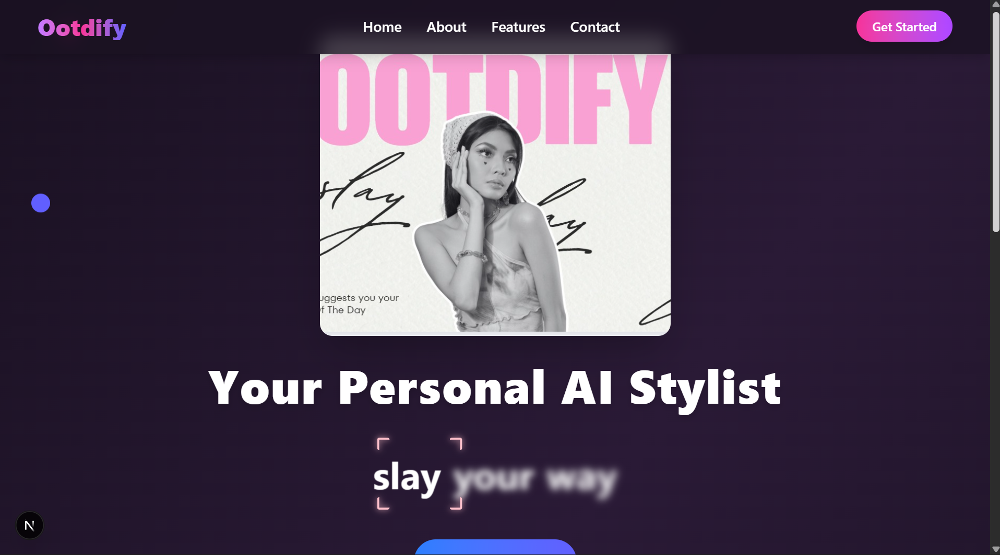
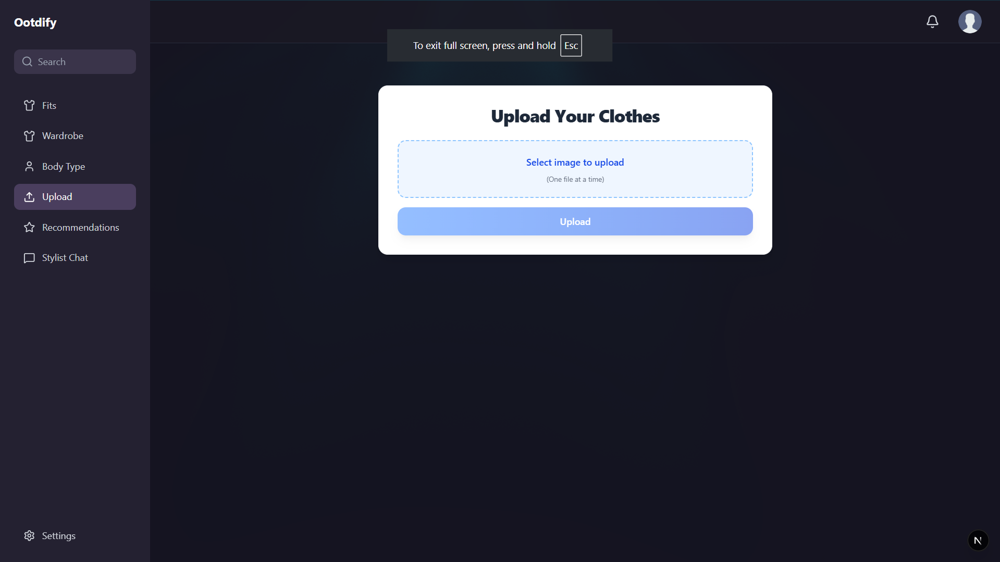
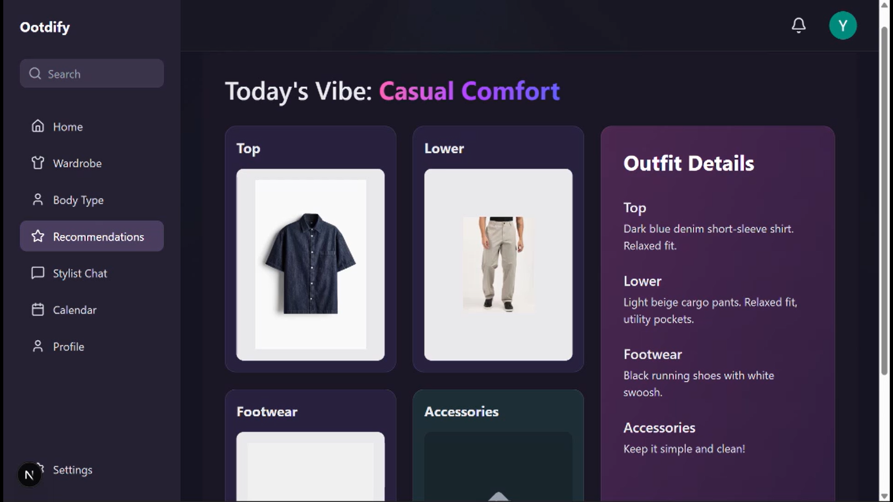
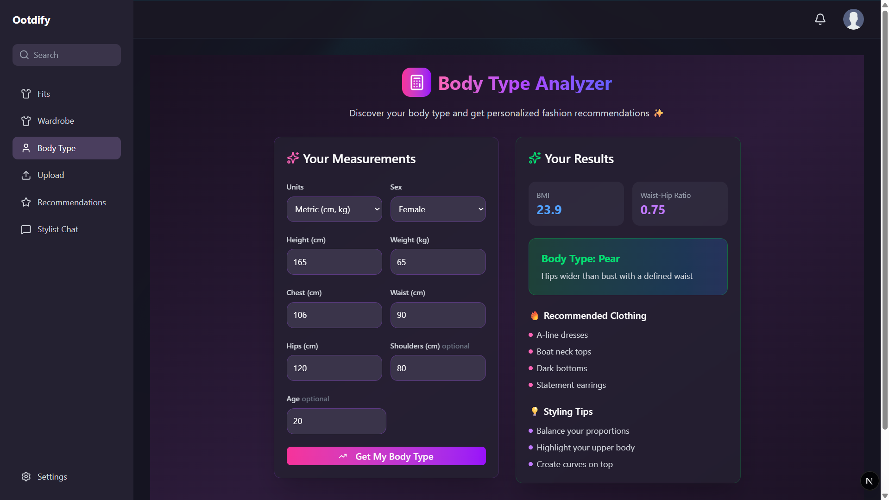
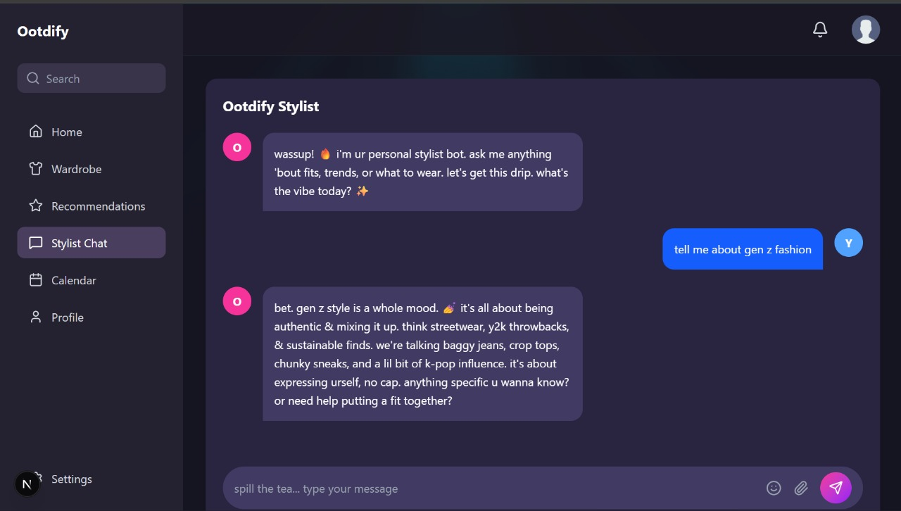

# OOTDify

<p align="center">
  
</p>

**OOTDify** is a cutting-edge, AI-powered fashion platform designed to revolutionize how GenZ and trend-conscious users interact with their wardrobes. Effortlessly organize your clothes, receive personalized outfit recommendations, analyze your body type, and chat with your own stylist bot—all in one sleek app. OOTDify makes fashion fun, easy, and uniquely yours.

---

## 🧩 The Problem: Fashion Fatigue for GenZ & Trend-Conscious People

<p align="center">
  
</p>

Fashion is a powerful form of self-expression, especially for GenZ and those who love to stay ahead of trends. However, this passion comes with its own set of challenges:

- **Decision Fatigue:** Endless hours spent deciding what to wear, trying to match trends or create new looks.
- **Underused Wardrobe:** Clothes bought for a vibe or occasion often end up forgotten and unworn.
- **Overwhelming Choices:** Fast fashion and countless options make it hard to keep track of what you own and how to style it.
- **Lack of Personalization:** Most fashion apps and advice ignore your unique body type, preferences, and actual wardrobe.

---

## 💡 How OOTDify Solves This

<p align="center">
  
</p>

OOTDify is crafted to make fashion effortless, enjoyable, and personal:

- **Smart Digital Wardrobe:** Seamlessly upload and organize your clothes, ensuring you never forget a piece.
- **AI-Powered Recommendations:** Receive daily outfit ideas tailored to your wardrobe, body type, and the latest trends—eliminating indecision.
- **Body Type Analyzer:** Discover your body shape and unlock style tips that truly flatter you.
- **Virtual Try-On:** Experiment with outfits before wearing them, boosting confidence and reducing regret.
- **Personal Stylist Chatbot:** Get instant advice, trend updates, and fashion tips from your own AI stylist.
- **Community & Brands:** Explore new styles, connect with fellow fashion enthusiasts, and discover trending brands.

---

<p align="center">
  
</p>

OOTDify is your personal AI-powered fashion stylist and digital wardrobe. Organize your clothes, get daily outfit recommendations, analyze your body type for personalized style tips, and interact with an AI stylist chatbot. Built with Next.js, Prisma, and a modern UI, OOTDify brings the future of fashion to your fingertips.

---

## ✨ Features

### 1. Digital Wardrobe

<p align="center">
  
</p>

- Upload photos of your clothes to create a smart, digital closet.
- View, filter, and organize your wardrobe by category (tops, bottoms, outerwear, shoes, accessories).
- Add new items easily and see all your clothes in one place.

### 2. AI-Powered Outfit Recommendations

<p align="center">
  
</p>

- Get daily outfit suggestions based on your wardrobe, weather, occasion, and body type.
- See recommended fits with images and simple descriptions.
- Save and shuffle outfit combinations.

### 3. Body Type Analyzer

<p align="center">
  
</p>

- Enter your measurements to discover your body type (Hourglass, Pear, Rectangle, etc.).
- Receive personalized clothing recommendations and styling tips tailored to your body shape.

### 4. Virtual Try-On (Beta)
- Preview how outfits might look before getting dressed (experimental feature).

### 5. AI Stylist Chatbot

<p align="center">
  
</p>

- Chat with your personal stylist bot for advice on trends, what to wear, and fashion tips.
- Supports markdown, images, and interactive conversation.

### 6. Community & Brands
- Discover trending categories, featured brands, and new arrivals.
- Join the OOTDify community to share and explore styles.

### 7. Authentication & User Profiles
- Secure login with Google via NextAuth.
- Personalized experience based on user preferences and wardrobe.

---

## 🛠 Tech Stack

- **Frontend:** Next.js, React, Tailwind CSS, Radix UI, Lucide Icons
- **Backend:** Next.js API routes, Express (for AI/chatbot), Prisma ORM, PostgreSQL
- **AI:** Google GenAI, custom recommendation logic
- **Image Uploads:** Cloudinary
- **Authentication:** NextAuth.js

---

## 📁 Folder Structure

- `src/app/` — Main app pages (dashboard, wardrobe, upload, recommendations, chatbot, body-type analyzer)
- `src/components/` — Reusable UI and feature components
- `src/context/` — User context and state management
- `prisma/` — Database schema and migrations
- `public/` — Static assets and images
- `test-outfits/` — Sample outfit images for testing

---

## 🚀 Getting Started

1. **Install dependencies:**
    ```bash
    npm install
    ```
2. **Set up environment variables:**
    - Create a `.env` file with your database and API keys (see `prisma/schema.prisma` for DB setup).
3. **Run database migrations:**
    ```bash
    npx prisma migrate dev
    ```
4. **Start the development server:**
    ```bash
    npm run dev
    ```

---

## 🔗 API Endpoints

- `/api/add-clothes` — Upload new clothing items
- `/api/recommend-clothes` — Get outfit recommendations
- `/api/ai-chat-bot` — Chatbot endpoint
- `/api/view-clothes` — View wardrobe items
- `/api/preferences` — Save user preferences
- `/api/auth/[...nextauth]` — Authentication
